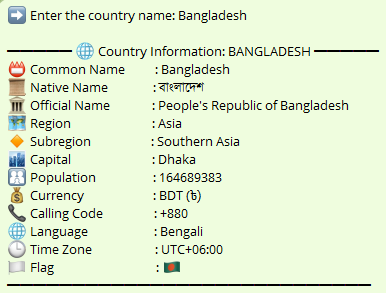

# Country Info Finder
## Features

- Get basic and advanced details about any country:
  - Common & Official names
  - Native names
  - Region & Subregion
  - Capital
  - Population
  - Currency
  - Country code
  - Language
  - Timezone
  - National Flag (Emoji)
- Handles invalid input gracefully
- Easy to use and beginner-friendly

---

## Technologies Used

- Python
- `requests` library
- REST API (`https://restcountries.com/v3.1`)

---

## ▶️ How to Run

**1. Clone this repository**  
$ `git clone https://github.com/mahmud-hassan-rafi/API-requests-projects/Country-info-finder.git`

**2. Install the required library**

$ `pip install requests` 

**3. Run the script**

$ `python main.py`

## Output

Here is an example of the country info finder output:

---

## License

This project is open-source and free to use under the [MIT License](LICENSE).

---

## Acknowledgements

- [REST Countries API](https://restcountries.com/)
- Developed by **Md Mahmud Hassan Rafi**

